# Configuration Guide

This guide explains how to configure the Home Assistant Dashboard using JSON, including all available card types, entity specification methods, and examples.

## Visual Card Reference

All available card types are documented in the [Card Components](#card-components) section with visual examples and configuration.

## Table of Contents

1. [Configuration File Structure](#configuration-file-structure)
2. [Entity Specification Methods](#entity-specification-methods)
3. [App Configuration](#app-configuration)
4. [View Configuration](#view-configuration)
5. [Card Components](#card-components)
6. [Configuration Examples](#configuration-examples)
7. [Validation & Error Handling](#validation--error-handling)

## Configuration File Structure

The main configuration file is `public/data/dashboard-config.json`. It defines the entire dashboard structure without touching code.

```json
{
  "app": {
    "title": "My Dashboard",
    "baseUrl": "",
    "developerMode": false,
    "localMode": false
  },
  "haConfig": {
    "haUrl": "https://your-ha-url:8123",
    "accessToken": "your-long-lived-token"
  },
  "views": [
    {
      "name": "overview",
      "label": "Overview",
      "icon": "mdi mdi-view-dashboard",
      "enabled": true,
      "entities": [
        { "entity": "light.living_room" },
        { "type": "HaEntityList", "getter": "getTemperatureSensors" }
      ]
    }
  ]
}
```

## Areas & Devices

The dashboard integrates with Home Assistant's area organization and device registry to provide structured views of your smart home:

### Area Entities (Virtual Entities)

When the dashboard loads, it automatically creates **virtual area entities** for each area in Home Assistant. These appear in the sensor list with entity IDs in the format:

```
area.{area_id}
```

For example:
- `area.living_room`
- `area.bedroom`
- `area.kitchen`

These virtual entities:
- Display the area's name, icon, and picture (if available)
- Can be filtered by in the Entity Dashboard view
- Help visualize the area-to-device-to-entity hierarchy
- Are automatically managed and don't require configuration

### Device Organization

Devices are automatically fetched from Home Assistant and:
- Grouped by their assigned area
- Include all associated entity mappings
- Display in the Devices view with area filtering
- Support searching by device name

### Entity to Device Mapping

The dashboard uses Home Assistant's entity registry to map each entity to its device:

1. **REST API** fetches initial entity states
2. **WebSocket Entity Registry** provides device_id mappings
3. **Device Registry** associates devices with areas
4. Dashboard creates the complete hierarchy: **Area → Device → Entity**

This allows you to:
- Filter entities by area in the Entity Dashboard
- View all devices in a specific area
- See which entities belong to which devices
- Understand your smart home structure

### Getter Functions for Areas

You can use the area filtering in the dashboard UI or filter entities by area using custom logic:

```json
{
  "type": "HaEntityList",
  "getter": "getSensors"
}
```

Combine with the Entity Dashboard's area filter dropdown to view entities grouped by area.

## Entity Specification Methods

There are three ways to specify which entities to display in a card:

### 1. Direct Entity Reference

Specify a single entity by its Home Assistant entity ID:

```json
{
  "entity": "light.living_room"
}
```

The dashboard automatically detects the component type based on the entity domain:

| Domain | Component |
|--------|-----------|
| `light.*` | HaLight |
| `switch.*` | HaSwitch |
| `sensor.*` | HaSensor |
| `binary_sensor.*` | HaBinarySensor |
| `weather.*` | HaWeather |
| `sun` | HaSun |
| `media_player.*` | HaMediaPlayer |
| `alarm_control_panel.*` | HaAlarmPanel |
| `person.*` | HaPerson |
| `input_select.*` | HaSelect |
| `input_button.*` | HaButton |

If you need a different component for a specific entity, you can explicitly set the `type` property.

### 2. Getter Functions

Call custom functions on the store to dynamically filter entities:

```json
{
  "type": "HaEntityList",
  "getter": "getBatterySensors"
}
```

Getter functions return arrays of entities. The following getters are available:

### Available Getters

**Battery & Power Monitoring:**
- `getBatterySensors()` — Sensors with `device_class: battery` and state < 100%
- `getWifiSensors()` — Sensors with WiFi icon and available state

**Entity Type Getters:**
- `getAll()` — All available entities
- `getSensors()` — All sensor.* entities
- `getLights()` — All light.* entities
- `getSwitches()` — All switch.* entities
- `getBinarySensors()` — All binary_sensor.* entities
- `getFans()` — All fan.* entities
- `getSelects()` — All select.* entities
- `getButtons()` — All button.* entities
- `getMediaPlayers()` — All media_player.* entities
- `getAlarmPanels()` — All alarm_control_panel.* entities
- `getDeviceTrackers()` — All device_tracker.* entities
- `getSuns()` — All sun.* entities

**Device-based Getters:**
- `getEntitiesForDevice(deviceId)` — All entities for a specific device

**Area-based Features:**
- Filter by area in the **Entity Dashboard** view using the area dropdown
- Virtual area entities can be displayed like any other entity
- Device view supports filtering by area

## App Configuration

The `app` object configures dashboard-wide settings:

```json
{
  "app": {
    "title": "Home Dashboard",      // Browser title and navbar brand
    "developerMode": false,         // Show dev tools (save button, etc.)
    "localMode": false              // Use local cached data instead of HA
  }
}
```

### Properties

- **title** (string): Application title displayed in browser and navbar
- **developerMode** (boolean): Enable developer features (data export button)
- **localMode** (boolean): Load data from `public/local-data.json` instead of Home Assistant

### Base URL Configuration (Build-Time)

For subdirectory deployments (e.g., serving from `https://example.com/app/`), set the `VITE_BASE_URL` environment variable at build time:

```bash
# Option 1: Set when building
VITE_BASE_URL=/app/ npm run build

# Option 2: In .env file
echo "VITE_BASE_URL=/app/" >> .env
npm run build
```

This is a **build-time** setting that affects:
- Asset paths (CSS, JS, images)
- Service worker scope
- PWA manifest URLs
- Configuration and data file locations

**Note**: `VITE_BASE_URL` is a Vite build configuration, not a runtime setting in `dashboard-config.json`.

## HA Configuration

The `haConfig` object contains Home Assistant connection details:

```json
{
  "haConfig": {
    "haUrl": "https://ha.home.local:8123",
    "accessToken": "eyJhbGciOiJIUzI1NiIsInR5cCI6IkpXVCJ9..."
  }
}
```

### Properties

- **haUrl** (string, optional): Full URL to your Home Assistant instance
- **accessToken** (string, optional): Long-lived access token

### Credential Management

You have two options for managing credentials:

### Option 1: Store in Configuration (Recommended for shared dashboards)

```json
{
  "haConfig": {
    "haUrl": "https://ha.home.local:8123",
    "accessToken": "eyJhbGciOiJIUzI1NiIsInR5cCI6IkpXVCJ9..."
  }
}
```

When credentials are provided in the config file, they are used automatically on each page load.

### Option 2: Prompt User (Recommended for personal devices)

Leave both `haUrl` and `accessToken` empty:

```json
{
  "haConfig": {
    "haUrl": "",
    "accessToken": ""
  }
}
```

On first load, the dashboard will prompt the user to enter their Home Assistant URL and access token. The credentials are then **automatically saved to the browser's localStorage** and persist across sessions.

Users can update their credentials at any time by clicking the settings/profile menu and re-entering their information. If they clear browser storage or use incognito mode, they'll be prompted to enter credentials again.

### Hybrid Option: URL Only

You can also specify just the URL and leave the token empty:

```json
{
  "haConfig": {
    "haUrl": "https://ha.home.local:8123",
    "accessToken": ""
  }
}
```

Users will be prompted for only the access token, which is then saved to localStorage.

## View Configuration

Views are the top-level dashboard pages. Each view has a name, label, icon, and list of entities.

```json
{
  "views": [
    {
      "name": "overview",
      "label": "Overview",
      "icon": "mdi mdi-view-dashboard",
      "enabled": true,
      "entities": [ ... ]
    }
  ]
}
```

### View Properties

- **name** (string, required): Unique identifier (used in URLs and routing)
- **label** (string, required): Display name shown in the navbar
- **icon** (string, optional): Material Design Icons class (e.g., `mdi mdi-lightbulb`)
- **hidden** (boolean, optional, default: false): Hide view from navbar navigation
- **entities** (array, required): List of card configurations for this view

### Icon Format

Icons use Material Design Icons (MDI). The format is flexible and accepts:

- `mdi-icon-name` — Simplified format (prefix added automatically)
- `mdi mdi-icon-name` — Full format (classic)
- `mdi:icon-name` — Home Assistant format (auto-converted)

Common icons:

- `mdi-view-dashboard` — Dashboard
- `mdi-lightbulb` — Lights
- `mdi-power-plug` — Switches/Outlets
- `mdi-thermometer` — Temperature
- `mdi-battery` — Battery
- `mdi-wifi` — WiFi
- `mdi-cloud` — Weather
- `mdi-lock` — Security

See [Material Design Icons](https://materialdesignicons.com) for the full list.

## Card Components

Cards are the individual UI elements that display entity data. Each card type handles a specific Home Assistant domain or use case. Each card section below includes a visual example and configuration details.

### HaSensor

**Single Sensor:**

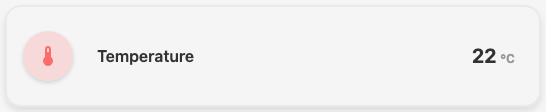

Displays numeric sensor data with value, unit, and optional attributes.

**Use for**: Temperature, humidity, battery percentage, any numeric sensor

**Multiple Sensors:**

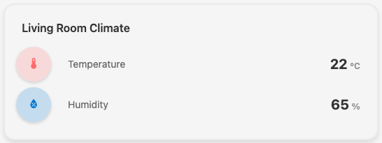

Display multiple sensor values in one card.

**Properties**:

- `entity` (string|array|object, required): Sensor entity ID(s) or entity objects
- `attributes` (array, optional, default: []): Attribute keys to display below the state
- `type` (optional): Explicitly set to `HaSensor` to override auto-detection

**Examples**:

Single sensor with automatic type detection:

```json
{
  "type": "HaSensor",
  "entity": "sensor.temperature_living_room"
}
```

With additional attributes displayed:

```json
{
  "type": "HaSensor",
  "entity": "sensor.air_quality",
  "attributes": ["aqi", "pm25", "last_updated"]
}
```

Multiple sensors in one card:

```json
{
  "type": "HaSensor",
  "entity": [
    "sensor.temperature_living_room",
    "sensor.humidity_living_room"
  ]
}
```

### HaSensorGraph

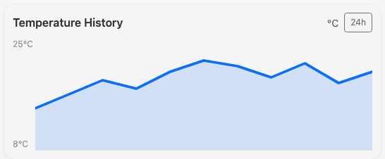

Displays sensor data as a line graph with history. Supports comparing 1-3 entities with color-coded lines.

**Use for**: Comparing multiple sensors of the **same data type** over time (e.g., multiple temperature sensors, multiple power readings)

**Important**: This component is designed to display entities with compatible units and ranges. Using entities with different units or vastly different value ranges may produce misleading visualizations.

**Properties**:

- `entity` (string | array, required): Single sensor entity ID or array of 1-3 entity IDs
  - Single entity: `"sensor.temperature_living_room"`
  - Multiple entities: `["sensor.temperature_living_room", "sensor.temperature_bedroom"]`
- `hours` (number, optional, default: 24): Hours of history to display
- `maxPoints` (number, optional, default: 200): Maximum data points to show
- `attributes` (array, optional): Additional attributes to display

**Graph Colors**:

- 1st entity: Blue (#0d6efd)
- 2nd entity: Red (#dc3545)
- 3rd entity: Green (#198754)

**Examples**:

Single temperature sensor with 48-hour history:

```json
{
  "type": "HaSensorGraph",
  "entity": "sensor.temperature_living_room",
  "hours": 48
}
```

Comparing temperatures from multiple rooms (same data type):

```json
{
  "type": "HaSensorGraph",
  "entity": ["sensor.temperature_living_room", "sensor.temperature_bedroom"],
  "hours": 24
}
```

Comparing power consumption across multiple sources (same unit):

```json
{
  "type": "HaSensorGraph",
  "entity": ["sensor.power_usage_main", "sensor.power_usage_ev_charger", "sensor.power_usage_solar"],
  "maxPoints": 150
}
```

**Migration Note**: If you have existing configurations using `secondEntity`, they will display a deprecation warning. Please migrate to the array syntax:

- Old: `"entity": "sensor.temp", "secondEntity": "sensor.humidity"`
- New: `"entity": ["sensor.temp_living_room", "sensor.temp_bedroom"]`

### HaBinarySensor

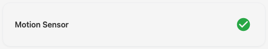

Displays binary state (on/off, open/closed, detected/not detected).

**Use for**: Motion sensors, door sensors, presence detection, binary switches

**Properties**:

- `entity` (string|object, required): Binary sensor entity ID or object

**Examples**:

Basic motion sensor:

```json
{
  "type": "HaBinarySensor",
  "entity": "binary_sensor.motion_living_room"
}
```

### HaLight

**Light On:**

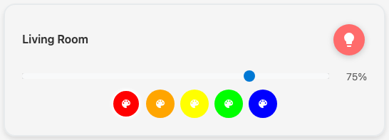

**Light Off:**

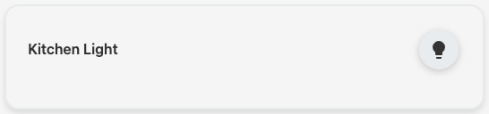

Interactive light control with on/off toggle and brightness slider.

**Use for**: Light entities (RGB, dimmable, white, etc.)

**Properties**:

- `entity` (string|object, required): Light entity ID or object
- `attributes` (array, optional, default: []): Additional attributes to display

**Examples**:

Basic dimmable light:

```json
{
  "type": "HaLight",
  "entity": "light.living_room"
}
```

With brightness attribute:

```json
{
  "type": "HaLight",
  "entity": "light.kitchen_cabinet",
  "attributes": ["brightness", "color_temp"]
}
```

RGB light with full control:

```json
{
  "type": "HaLight",
  "entity": "light.bedroom",
  "attributes": ["brightness", "color_temp", "hs_color"]
}
```

### HaSwitch

**Switch On:**

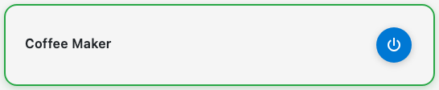

**Switch Off:**


Interactive switch control with on/off toggle.

**Use for**: Switches, outlets, fans, any toggle-able entity

**Properties**:

- `entity` (string|object, required): Switch entity ID or object
- `mock` (boolean, optional, default: false): Enable mock toggle for testing without HA

**Examples**:

Basic switch:

```json
{
  "type": "HaSwitch",
  "entity": "switch.kitchen_outlet"
}
```

Mock switch for testing:

```json
{
  "type": "HaSwitch",
  "entity": "switch.test_device",
  "mock": true
}
```

### HaWeather

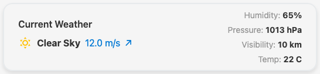

Displays weather forecast with temperature, conditions, wind speed.

**Use for**: Weather integration entities

**Properties**:

- `entity` (string|object, required): Weather entity ID or object
- `forecast` (boolean, optional, default: true): Show/hide the 3-day forecast section
- `attributes` (array, optional, default: []): Additional attributes to display

**Examples**:

Basic weather:

```json
{
  "type": "HaWeather",
  "entity": "weather.forecast_home"
}
```

Hide forecast section:

```json
{
  "type": "HaWeather",
  "entity": "weather.forecast_home",
  "forecast": false
}
```

### HaEnergy

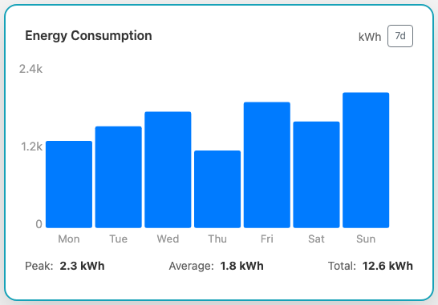

Displays energy consumption with interactive bar chart, smart data aggregation, and real-time statistics.

**Use for**: Energy/power sensor analytics with historical data visualization

**Features**:

- Interactive bar chart with 4 time periods (1d, 3d, 7d, 14d)
- Smart data aggregation: hourly bars for 1-day view, daily bars for 3+ days
- Real-time statistics: Peak, Average, Total consumption
- Hover tooltip showing exact values
- Auto-detection of energy/power sensors (zero-config support)
- Automatic unit detection and formatting

**Properties**:

- `entity` (string|object, optional): Energy sensor entity ID or object
  - If not specified, automatically detects entities matching `sensor.*_energy*` or `sensor.*_power*` patterns
- `attributes` (array, optional, default: []): Additional attributes to display below statistics
- `type` (optional): Explicitly set to `HaEnergy` to override auto-detection

**Time Periods**:

- **1d** (24 hours): Hourly aggregation with 24 bars
- **3d** (3 days): Daily aggregation with 3 bars
- **7d** (7 days): Daily aggregation with 7 bars
- **14d** (14 days): Daily aggregation with 14 bars

Click the period button to cycle through available time periods.

**Statistics Displayed**:

- **Peak**: Maximum consumption value in the period
- **Average**: Mean consumption across all buckets
- **Total**: Sum of consumption for the entire period

**Examples**:

Zero-config energy display (auto-detects energy sensors):

```json
{
  "type": "HaEnergy"
}
```

Specific energy sensor:

```json
{
  "type": "HaEnergy",
  "entity": "sensor.energy_total"
}
```

Power sensor with attributes:

```json
{
  "type": "HaEnergy",
  "entity": "sensor.power_consumption",
  "attributes": ["last_updated", "source"]
}
```

### HaSun

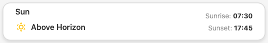

Displays sun position, sunrise/sunset times.

**Use for**: `sun.sun` entity

**Properties**:

- `entity` (string|object, required): Sun entity ID or object

**Examples**:

Basic sun display:

```json
{
  "type": "HaSun",
  "entity": "sun.sun"
}
```

### HaMediaPlayer

Controls media playback (play/pause, volume, track info).

**Use for**: Audio/video players, media integrations

**Properties**:

- `entity` (string|object, required): Media player entity ID or object

**Examples**:

Basic media player:

```json
{
  "type": "HaMediaPlayer",
  "entity": "media_player.living_room_speaker"
}
```

### HaAlarmPanel

Displays and controls alarm system state (armed/disarmed, modes).

**Use for**: Alarm control panel entities

**Properties**:

- `entity` (string|object, required): Alarm panel entity ID or object

**Examples**:

Basic alarm panel:

```json
{
  "type": "HaAlarmPanel",
  "entity": "alarm_control_panel.home"
}
```

### HaPrinter

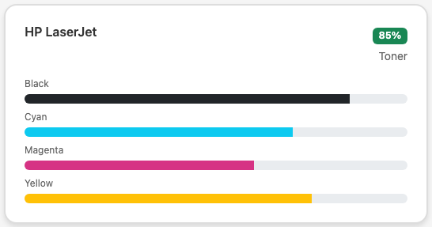

Displays printer status including toner levels.

**Use for**: Printer entities with toner sensors

**Properties**:

- `entity` (string|object, required): Main printer sensor entity ID or object
- `black` (string, required): Black toner sensor entity ID
- `cyan` (string, required): Cyan toner sensor entity ID
- `magenta` (string, required): Magenta toner sensor entity ID
- `yellow` (string, required): Yellow toner sensor entity ID
- `attributes` (array, optional, default: []): Additional attributes to display

**Examples**:

HP printer with toner monitoring:

```json
{
  "type": "HaPrinter",
  "entity": "sensor.hp_printer_status",
  "black": "sensor.hp_printer_black_toner",
  "cyan": "sensor.hp_printer_cyan_toner",
  "magenta": "sensor.hp_printer_magenta_toner",
  "yellow": "sensor.hp_printer_yellow_toner"
}
```

### HaPerson

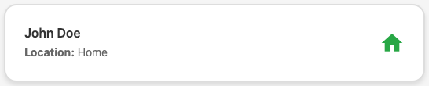

Displays person tracking information (location, state).

**Use for**: Person tracking entities

**Properties**:

- `entity` (string|object, required): Person entity ID or object

**Examples**:

Basic person tracking:

```json
{
  "type": "HaPerson",
  "entity": "person.john_doe"
}
```

Family member location:

```json
{
  "type": "HaPerson",
  "entity": "person.jane_smith"
}
```

### HaChip

Compact sensor display, great for dashboards with many items.

**Use for**: Quick reference sensors that don't need much space

**Properties**:

- `entity` (string|object, required): Sensor entity ID or object
- `attributes` (array, optional, default: []): Additional attributes to display

**Examples**:

Time chip:

```json
{
  "type": "HaChip",
  "entity": "sensor.time"
}
```

Battery level chip:

```json
{
  "type": "HaChip",
  "entity": "sensor.phone_battery",
  "attributes": ["battery_state"]
}
```

### HaWarning

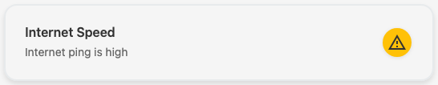

Displays a warning message when a condition is met (yellow styling).

**Use for**: Conditional warnings based on entity state

**Properties**:

- `entity` (string|object, required): Entity to monitor
- `attribute` (string, optional, default: "state"): Entity attribute to check
- `operator` (string, required): Comparison operator
- `value` (string|number|boolean, required): Value to compare against
- `message` (string, required): Warning message to display

**Operators**: `=`, `!=`, `>`, `<`, `>=`, `<=`, `contains`, `not_contains`, `in`, `not_in`

**Examples**:

High temperature warning:

```json
{
  "type": "HaWarning",
  "entity": "sensor.cpu_temperature",
  "operator": ">",
  "value": 80,
  "message": "CPU temperature is high!"
}
```

Door open warning:

```json
{
  "type": "HaWarning",
  "entity": "binary_sensor.back_door",
  "operator": "=",
  "value": "on",
  "message": "Back door is open"
}
```

High power consumption:

```json
{
  "type": "HaWarning",
  "entity": "sensor.power_usage",
  "operator": ">",
  "value": 3000,
  "message": "High power consumption detected",
  "attribute": "state"
}
```

### HaError

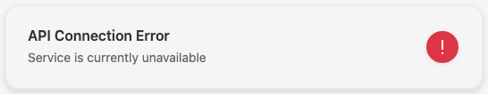

Displays an error message when a condition is met (red styling).

**Use for**: Error states and critical alerts

**Properties**:

- `entity` (string|object, required): Entity to monitor
- `attribute` (string, optional, default: "state"): Entity attribute to check
- `operator` (string, required): Comparison operator
- `value` (string|number|boolean, required): Value to compare against
- `message` (string, required): Error message to display

**Operators**: `=`, `!=`, `>`, `<`, `>=`, `<=`, `contains`, `not_contains`, `in`, `not_in`

**Examples**:

Home Assistant update available:

```json
{
  "type": "HaError",
  "entity": "update.home_assistant",
  "operator": "!=",
  "value": "off",
  "message": "Home Assistant updates available"
}
```

Internet connection lost:

```json
{
  "type": "HaError",
  "entity": "binary_sensor.internet_connection",
  "operator": "=",
  "value": "off",
  "message": "Internet connection lost"
}
```

Disk space critical:

```json
{
  "type": "HaError",
  "entity": "sensor.disk_free",
  "operator": "<",
  "value": 1000,
  "message": "Low disk space!"
}
```

### HaImage

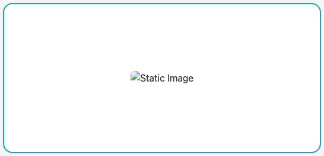

Displays an image from the local data directory or external URL. Images are resized to fit within the standard card container (col-md-4).

**Use for**: Photos, diagrams, floor plans, visual dashboards

**Properties**:

- `url` (string, required): Path to image file relative to `/data/` directory, or full URL
- `title` (string, optional, default: "Image"): Image title/alt text

**Examples**:

Local SVG floor plan:

```json
{
  "type": "HaImage",
  "url": "images/home.svg",
  "title": "Home Overview"
}
```

Local PNG floor plan:

```json
{
  "type": "HaImage",
  "url": "images/floorplan.png",
  "title": "Floor Plan"
}
```

External image:

```json
{
  "type": "HaImage",
  "url": "https://example.com/image.jpg",
  "title": "External Image"
}
```

### HaHeader

Displays a section header with optional icon.

**Use for**: Visual organization and section titles

**Properties**:

- `name` (string, required): Header text
- `icon` (string, optional): Material Design Icons class

**Examples**:

Header with icon:

```json
{
  "type": "HaHeader",
  "name": "Living Room",
  "icon": "mdi mdi-sofa"
}
```

Simple header without icon:

```json
{
  "type": "HaHeader",
  "name": "Security"
}
```

Section header with device icon:

```json
{
  "type": "HaHeader",
  "name": "Bedroom",
  "icon": "mdi mdi-bed"
}
```

### HaGauge

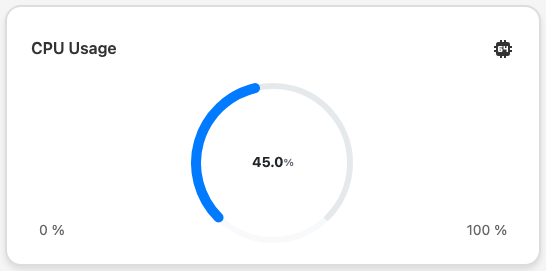

Displays a gauge visualization for numeric sensor values.

**Use for**: Visual representation of values (temperature, pressure, fill level, etc.)

**Properties**:

- `entity` (string|object, optional): Gauge entity ID or object
- `min` (number, optional, default: 0): Minimum gauge value
- `max` (number, optional, default: 100): Maximum gauge value

**Examples**:

Temperature gauge:

```json
{
  "type": "HaGauge",
  "entity": "sensor.temperature_living_room",
  "min": -10,
  "max": 50
}
```

Battery level gauge:

```json
{
  "type": "HaGauge",
  "entity": "sensor.phone_battery",
  "min": 0,
  "max": 100
}
```

Pressure gauge:

```json
{
  "type": "HaGauge",
  "entity": "sensor.atmospheric_pressure",
  "min": 950,
  "max": 1050
}
```

### HaRoom

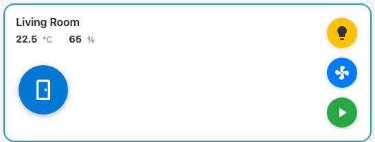

Displays an area/room card with temperature/humidity auto-detection and up to 3 control objects.

**Use for**: Area-based room displays with device controls (lights, switches, fans, media players)

**Properties**:

- `entity` (string|array, required): Entity ID or array of entity IDs (area entity + up to 3 control objects)
- `color` (string, optional, default: "blue"): CSS color name for the room circle

**Features**:

- Auto-detects area entity by `area.*` prefix (order-independent)
- Automatically finds temperature sensors (device_class: temperature)
- Automatically finds humidity sensors (device_class: humidity)
- Displays up to 3 control objects as clickable circles
- Shows area icon in the main circle
- Domain-specific colors:
  - **Lights**: Yellow (#ffc107)
  - **Fans**: Blue (#007bff)
  - **Media Players**: Green (#28a745)
  - **Other entities**: Green (#28a745)
- Domain-specific icons with dynamic states:
  - **Media Players**: Play icon when paused, pause icon when playing
  - **Fans**: Fan icon
  - **Lights**: Lightbulb icon
  - **Switches**: Power plug icon

**Examples**:

Simple string format (converted to array internally):

```json
{
  "type": "HaRoom",
  "entity": "area.bedroom"
}
```

Array format with control objects:

```json
{
  "type": "HaRoom",
  "entity": ["area.bedroom", "light.bedroom", "switch.fan"]
}
```

Living room with custom color:

```json
{
  "type": "HaRoom",
  "entity": ["area.living_room", "light.living_room", "switch.outlet"],
  "color": "red"
}
```

Kitchen with multiple control objects (limited to 3):

```json
{
  "type": "HaRoom",
  "entity": [
    "area.kitchen",
    "light.kitchen_main",
    "light.kitchen_island",
    "switch.kitchen_exhaust"
  ],
  "color": "orange"
}
```

**Notes**:

- Only the first 3 control objects (non-area entities) will be displayed to maintain layout
- Control objects support on/off toggle for switches, lights, and fans
- Media players use play/pause controls instead of on/off
- Temperature and humidity are automatically discovered from the area's entities

### HaEntityList

Renders a dynamic list of entities from a getter function.

**Use for**: Dynamic entity filtering (batteries below 20%, offline devices, etc.)

**Properties**:

- `type` (required): Must be `HaEntityList`
- `getter` (string, required): Name of getter function on store
- `componentMap` (object, optional, default: {}): Override component types for specific domains
- `attributes` (array, optional, default: []): Attributes to display

**Examples**:

Show all low battery devices:

```json
{
  "type": "HaEntityList",
  "getter": "getBatterySensors"
}
```

With custom component mapping:

```json
{
  "type": "HaEntityList",
  "getter": "getLowBatterySensors",
  "componentMap": {
    "switch": "HaWarning",
    "sensor": "HaChip"
  }
}
```

Wifi sensors with attributes:

```json
{
  "type": "HaEntityList",
  "getter": "getWifiSensors",
  "attributes": ["signal_strength", "ssid"]
}
```

### HaSelect

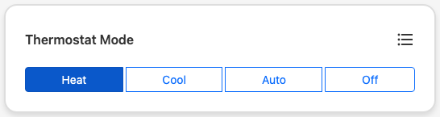

Dropdown selector for input_select entities.

**Use for**: Input select entities (mode selection, scenes, etc.)

**Properties**:

- `entity` (string|object, required): Input select entity ID or object

**Examples**:

Home mode selector:

```json
{
  "type": "HaSelect",
  "entity": "input_select.home_mode"
}
```

### HaButton

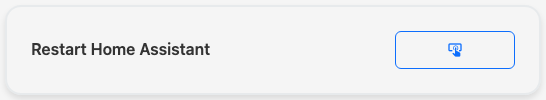

Button trigger for input_button entities.

**Use for**: One-click automations and scripts

**Properties**:

- `entity` (string|object, required): Input button entity ID or object

**Examples**:

Notification trigger:

```json
{
  "type": "HaButton",
  "entity": "input_button.notify_me"
}
```

Scene activation button:

```json
{
  "type": "HaButton",
  "entity": "input_button.activate_movie_mode"
}
```

Restart automation:

```json
{
  "type": "HaButton",
  "entity": "input_button.restart_automations"
}
```


---

## Configuration Examples

### Example 1: Simple Overview Dashboard

```json
{
  "app": {
    "title": "Home Dashboard",
    "baseUrl": "",
    "developerMode": false,
    "localMode": false
  },
  "haConfig": {
    "haUrl": "https://ha.home.local:8123",
    "accessToken": "eyJhbGciOiJIUzI1NiIsInR5cCI6IkpXVCJ9..."
  },
  "views": [
    {
      "name": "overview",
      "label": "Overview",
      "icon": "mdi mdi-view-dashboard",
      "entities": [
        {
          "type": "HaHeader",
          "name": "Status",
          "icon": "mdi mdi-information"
        },
        { "entity": "sensor.time", "type": "HaChip" },
        { "entity": "weather.home" },
        { "entity": "sun.sun" },
        {
          "type": "HaHeader",
          "name": "Living Room"
        },
        { "entity": "light.living_room" },
        { "entity": "sensor.temperature_living_room" },
        { "entity": "binary_sensor.motion_living_room" }
      ]
    }
  ]
}
```

### Example 2: Multi-View Dashboard with Conditionals

```json
{
  "app": {
    "title": "Smart Home",
    "baseUrl": "",
    "developerMode": false,
    "localMode": false
  },
  "haConfig": {
    "haUrl": "https://ha.home.local:8123",
    "accessToken": "..."
  },
  "views": [
    {
      "name": "overview",
      "label": "Overview",
      "icon": "mdi mdi-view-dashboard",
      "entities": [
        {
          "type": "HaError",
          "entity": "sensor.internet_ping",
          "operator": ">",
          "value": 50,
          "message": "High internet latency"
        },
        { "entity": "weather.home" },
        {
          "type": "HaWarning",
          "entity": "sensor.power_usage",
          "operator": ">",
          "value": 3000,
          "message": "High power consumption"
        }
      ]
    },
    {
      "name": "lights",
      "label": "Lighting",
      "icon": "mdi mdi-lightbulb",
      "entities": [
        { "entity": "light.living_room" },
        { "entity": "light.bedroom" },
        { "entity": "light.kitchen" },
        { "entity": "light.bathroom" }
      ]
    },
    {
      "name": "climate",
      "label": "Climate",
      "icon": "mdi mdi-thermometer",
      "entities": [
        {
          "entity": "sensor.temperature_living_room",
          "type": "HaSensorGraph",
          "hours": 24
        },
        {
          "entity": "sensor.humidity_living_room",
          "type": "HaSensorGraph"
        }
      ]
    },
    {
      "name": "battery",
      "label": "Battery",
      "icon": "mdi mdi-battery",
      "entities": [
        {
          "type": "HaEntityList",
          "getter": "getBatterySensors"
        }
      ]
    }
  ]
}
```

### Example 3: Dashboard with Dynamic Filtering

```json
{
  "views": [
    {
      "name": "monitoring",
      "label": "Monitoring",
      "icon": "mdi mdi-alert",
      "entities": [
        {
          "type": "HaHeader",
          "name": "Low Battery Devices",
          "icon": "mdi mdi-battery-alert"
        },
        {
          "type": "HaEntityList",
          "getter": "getLowBatterySensors"
        },
        {
          "type": "HaHeader",
          "name": "Offline Devices"
        },
        {
          "type": "HaEntityList",
          "getter": "getOfflineDevices"
        }
      ]
    }
  ]
}
```

## Validation & Error Handling

The dashboard validates the configuration and shows errors if there are problems.

### Common Errors

#### Invalid prop: type check failed for prop 'entities'

- Check that `entities` array is present and is an array
- Verify HaEntityList has the `getter` or `entities` property

#### Entity not found: sensor.unknown

- Verify the entity ID matches Home Assistant's actual entity
- Check entity is available in Home Assistant

#### Missing required prop: 'entity'

- Cards require an `entity` property (except HaHeader, HaSpacer, HaEntityList)
- Double-check the entity is specified

#### Invalid operator: '>'

- For HaWarning/HaError, use valid operators: `=`, `!=`, `>`, `<`, `>=`, `<=`, `contains`, `not_contains`, `in`, `not_in`

### Enabling Debug Mode

To see detailed validation errors:

1. Set `developerMode: true` in `app` config
2. Open browser console (F12)
3. Validation errors appear both in the UI and console

## Tips & Best Practices

1. **Use getters for dynamic filtering** instead of hardcoding entity lists
2. **Group related entities** with HaHeader for better organization
3. **Provide meaningful attributes** to give users context
4. **Use HaWarning/HaError** to highlight important conditions
5. **Test configuration** by reloading the page (F5) to catch JSON errors
6. **Use HaSpacer** between sections for better visual hierarchy
7. **Keep views focused** — one view per topic (lights, climate, security, etc.)
8. **Organize devices by area** — Use the Devices view with area filtering to see device organization
9. **Filter entities by area** — Use the Entity Dashboard's area dropdown to view entities by area
10. **Include virtual area entities** — Display area entities like `area.living_room` to show area status

## Unsupported Entity Types

The following Home Assistant entity types are not yet supported by the dashboard. While they can be added to the configuration, they will display as generic card placeholders:

**Unsupported Domains**:

- `automation.*` — Home Assistant automations
- `camera.*` — Security cameras and webcams
- `climate.*` — HVAC/Thermostat entities
- `cover.*` — Blinds, garage doors, covers
- `event.*` — Event tracking entities
- `fan.*` — Fan control entities
- `group.*` — Entity groups
- `input_boolean.*` — Input boolean helpers
- `input_number.*` — Input number helpers
- `number.*` — Numeric control entities
- `remote.*` — Remote control entities
- `scene.*` — Home Assistant scenes
- `script.*` — Home Assistant scripts
- `template.*` — Template entities
- `todo.*` — To-do list entities
- `zone.*` — Defined zones

**Note on Display vs. Control**: Some unsupported entity types can display their current state values using the standard `HaSensor` component (e.g., a fan's speed or a climate entity's temperature). However, interactive controls for these entities (e.g., changing fan speed, adjusting thermostat, opening/closing covers) are not yet implemented. This is primarily because the development lacks test data and devices for proper implementation and validation of the control logic.

**To Request Support**: If you need control support for an unsupported entity type, please open a GitHub issue on the [project repository](https://github.com/mp-se/hassio-dashboard) with:

- The entity type (e.g., `fan`, `climate`, `cover`)
- Example entity state structure from your Home Assistant (check Developer Tools → States)
- Description of the control actions needed

This helps prioritize features based on user demand and ensures proper testing support.

## Next Steps

After configuring your dashboard:

1. **Restart the container** to load the new configuration
2. **Test each view** to verify entities are displaying correctly
3. **Install the PWA** on your devices for native app experience
4. **Customize colors & layout** by editing component files if needed

For deployment help, see [Installation & Deployment Guide](./INSTALL.md).
