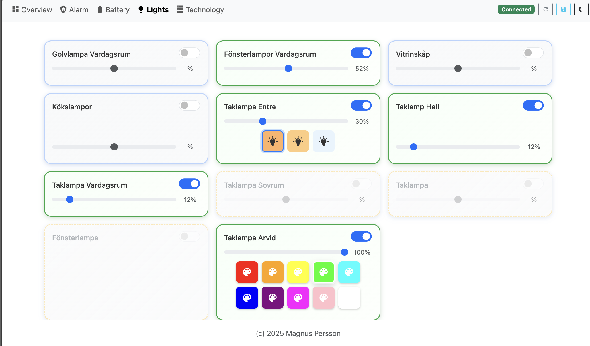

# Home Assistant Dashboard

A Vue.js dashboard app built with Vite that displays real-time sensor data from your local Home Assistant instance. Configure everything via a simple JSON file with support for multiple entity specification methods, dynamic filtering, and flexible card components.



This whole project has been an experiment to see what i could create using Github Copilot and let that do most of the coding and documenation.

Demo is available here: https://mp-se.github.io/ha-dashboard/


## ✨ Features

- **Real-time Updates**: WebSocket connection with automatic reconnection and exponential backoff
- **Area Organization**: View devices and entities grouped by Home Assistant areas with virtual area entities
- **JSON Configuration**: Entire dashboard driven by a single configuration file—no code changes needed
- **Flexible Entity Specification**: Direct references, wildcard patterns, or custom getter functions
- **Device & Area Support**: Browse devices organized by area, filter entities by area, view area entity mappings
- **Responsive Design**: Dark mode support with mobile-optimized layout
- **PWA Support**: Install as a native app on any device
- **Offline Fallback**: Service worker enables offline access with cached data
- **Security**: Self-signed SSL certificate support for local LAN deployment
- **Extensible**: Component-based architecture for easy customization
- **Error Resilience**: Network failures don't break the UI; connection status always visible

## 🎨 Card Types

The dashboard includes 26+ pre-built card components:

**Entity Controls**: Lights, Switches, Buttons, Select, Media Player
**Displays**: Sensors, Binary Sensors, Gauges, Chips, Text, Links, Images
**Information**: Weather, Sun, Person, Energy, Alarms, Printers
**Layout**: Spacers, Headers, Rows
**Advanced**: Sensor graphs, Entity lists, Custom getters

## 🚀 Quick Start

### 1. Prerequisites
- Docker and Docker Compose (or Node.js 18+ for development)
- Home Assistant instance with a long-lived access token

### 2. Configure the Dashboard

Edit `public/data/dashboard-config.json`:

```json
{
  "app": {
    "title": "My Dashboard",
    "developerMode": false,
    "localMode": false
  },
  "haConfig": {
    "haUrl": "https://your-ha-instance:8123",
    "accessToken": "your-long-lived-token-here"
  },
  "views": [
    {
      "name": "overview",
      "label": "Overview",
      "icon": "mdi mdi-view-dashboard",
      "entities": [
        { "entity": "light.living_room" },
        { "entity": "sensor.temperature_*" }
      ]
    }
  ]
}
```

### 3. Deploy with Docker

```bash
docker-compose up -d
```

Access at `https://localhost:8443` (or your configured domain).

## 📖 Documentation

- **[Installation & Deployment](./INSTALL.md)** — Docker setup, certificate generation, Portainer configuration
- **[Configuration Guide](./CONFIGURATION.md)** — JSON schema, all card types, entity specification methods, areas & devices, examples

## 🔒 Security Notes

- Credentials can be stored in the JSON config file or entered via the UI
- Stored credentials persist in browser localStorage
- Self-signed certificates require installation on client devices for PWA access
- Home Assistant token should be long-lived; rotate periodically in HA

## 🛠️ Development

```bash
npm install
npm run dev
```

App runs at `http://localhost:5173` with hot reload enabled.

## 📦 Project Structure

```
.
├── public/data/dashboard-config.json    # Main configuration file
├── src/
│   ├── components/                      # Card components
│   ├── stores/haStore.js                # State management
│   └── App.vue                          # Root component
├── docker/
│   ├── Dockerfile
│   ├── nginx.conf
│   └── ssl/                             # Certificates & generation script
└── package.json
```

## 🐛 Troubleshooting

See [INSTALL.md](./INSTALL.md) for deployment issues and [CONFIGURATION.md](./CONFIGURATION.md) for configuration problems.

## 📝 License

See LICENSE file for details.
